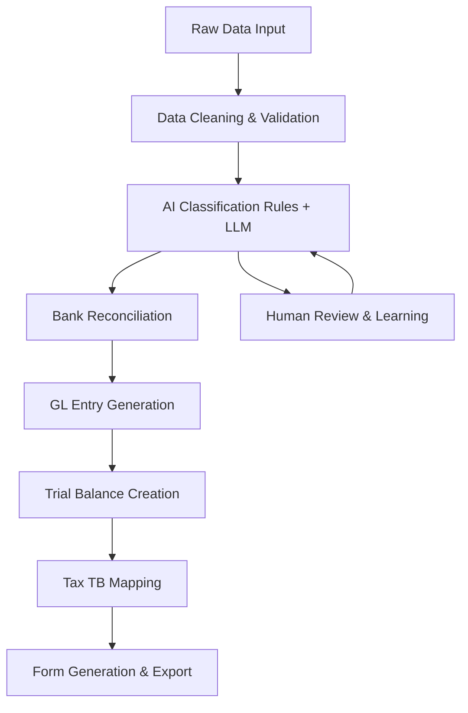

# 🗺️ AI Accounting System - 6-Week Implementation Roadmap

## 📋 Project Overview

**Goal**: Build enterprise-grade end-to-end tax compliance system
**Duration**: 6 weeks (Aug 18 - Sep 29, 2025)
**Team Structure**: Scalable for 1-4 developers

## 🎯 Core Workflow (8-Step Pipeline)



## 📅 Weekly Milestones & Deliverables

### **Week 1 (M1): Foundation & Data Pipeline**
**Focus**: Rock-solid data foundation + classification MVP

#### Key Deliverables:
- [ ] **Enhanced Data Models** 
  - Extend existing transaction/COA models
  - Add tax mapping tables (1120/1120S/1065)
  - Database migration scripts

- [ ] **Improved Data Ingestion**
  - Multi-format support (CSV, Excel, QBO, Xero)
  - Advanced validation & error handling
  - Duplicate detection algorithms

- [ ] **Hybrid Classification System**
  - Rule engine with regex patterns
  - LLM integration (OpenAI/Anthropic)
  - Self-learning feedback loop
  - Confidence scoring

#### Success Criteria:
- [ ] Process 1000+ transactions in <30 seconds
- [ ] Classification accuracy ≥95% on test dataset
- [ ] Zero data corruption in ingestion pipeline

### **Week 2 (M2): Reconciliation & GL Engine**
**Focus**: Automated matching + double-entry generation

#### Key Deliverables:
- [ ] **Advanced Reconciliation Engine**
  - Multi-strategy matching (exact/windowed/fuzzy/partial)
  - Machine learning similarity scoring
  - Bulk reconciliation workflows

- [ ] **General Ledger Automation**
  - Auto-generate double-entry from transactions
  - Trial balance calculation engine
  - Balance validation & error detection

- [ ] **Enhanced API Layer**
  - RESTful endpoints for all operations
  - Real-time status updates
  - Batch processing capabilities

#### Success Criteria:
- [ ] Auto-reconciliation rate ≥90%
- [ ] Perfect trial balance (debits = credits)
- [ ] API response time <2 seconds

### **Week 3 (M3): Tax Mapping & Compliance**
**Focus**: IRS-compliant tax categorization

#### Key Deliverables:
- [ ] **Tax Mapping Engine**
  - Complete 1120/1120S/1065 mappings
  - Multi-entity type support
  - Version control for tax rule changes

- [ ] **Tax Trial Balance Generator**
  - COA → Tax Category → Form Line mapping
  - Automated tax adjustments
  - Cross-entity consistency checks

- [ ] **Compliance Validation**
  - IRS business rule enforcement
  - Cross-reference validation
  - Audit trail generation

#### Success Criteria:
- [ ] 100% form line coverage for target entities
- [ ] Zero validation errors on sample data
- [ ] Full audit trail for all adjustments

### **Week 4 (M4): Form Builder & UI**
**Focus**: Professional form interface + validation

#### Key Deliverables:
- [ ] **Dynamic Form Builder**
  - Schema-driven form generation
  - Real-time validation & calculations
  - Draft save/restore functionality

- [ ] **Enhanced Frontend**
  - Professional tax form UI
  - Data visualization dashboards
  - Mobile-responsive design

- [ ] **PDF Generation**
  - IRS-compliant form templates
  - High-quality rendering
  - Batch export capabilities

#### Success Criteria:
- [ ] Forms render perfectly on all devices
- [ ] PDF export in <5 seconds
- [ ] Zero calculation errors in forms

### **Week 5 (M5): Book-to-Tax & Advanced Features**
**Focus**: Professional tax adjustments + Schedule M-1/M-2

#### Key Deliverables:
- [ ] **Book-to-Tax Adjustment Engine**
  - M-1/M-2 automation (50% meals, charitable limits, etc.)
  - Permanent vs. timing difference tracking
  - Multi-year carryforward calculations

- [ ] **Advanced Validation Framework**
  - Cross-form tie-out verification
  - Business rule compliance checking
  - Exception reporting & resolution

- [ ] **Analytics & Reporting**
  - Tax planning scenarios
  - Compliance risk indicators
  - Performance metrics dashboard

#### Success Criteria:
- [ ] All common tax adjustments automated
- [ ] Cross-form validation 100% accurate
- [ ] Advanced reports generate in <10 seconds

### **Week 6 (M6): Integration & Launch**
**Focus**: Production readiness + documentation

#### Key Deliverables:
- [ ] **Integration Layer**
  - QuickBooks/Xero API connections
  - Bank feed integrations
  - Third-party software APIs

- [ ] **Production Infrastructure**
  - Docker containerization
  - CI/CD pipeline setup
  - Monitoring & logging

- [ ] **Documentation & Training**
  - Complete API documentation
  - User training materials
  - Video tutorials & demos

#### Success Criteria:
- [ ] End-to-end regression tests pass
- [ ] Production deployment successful
- [ ] Complete documentation delivered

## 🏗️ Technical Architecture

### Backend Stack Enhancement
```
app/
├── modules/
│   ├── ingestion/          # Data import & cleaning
│   ├── classification/     # AI + rules hybrid
│   ├── reconciliation/     # Bank matching engine
│   ├── gl/                # General ledger automation
│   ├── tax/               # Tax compliance engine
│   ├── forms/             # Dynamic form builder
│   └── export/            # Multi-format output
├── schemas/
│   ├── entities/          # 1120/1120S/1065 definitions
│   ├── forms/            # IRS form structures
│   └── mappings/         # Tax category mappings
└── tests/
    ├── unit/             # Component testing
    ├── integration/      # API testing
    └── e2e/             # Full workflow testing
```

### Frontend Architecture
```
src/
├── pages/
│   ├── DataIngestion/    # Upload & preview
│   ├── Classification/   # Review & correct
│   ├── Reconciliation/   # Match & resolve
│   ├── TaxForms/        # Form builder UI
│   └── Analytics/       # Dashboards & reports
├── components/
│   ├── FormBuilder/     # Dynamic form renderer
│   ├── DataTables/      # Advanced data grids
│   └── Charts/          # Visualization widgets
└── services/
    ├── api/             # Backend integration
    ├── validation/      # Client-side validation
    └── export/          # Download & sharing
```

## 📊 Quality Gates & Metrics

### Performance Benchmarks
- **Data Ingestion**: 10,000 transactions/minute
- **Classification**: 95%+ accuracy, <2s per 100 transactions
- **Reconciliation**: 90%+ auto-match rate
- **Form Generation**: <5 seconds for complete 1120 package
- **PDF Export**: <3 seconds per form

### Testing Coverage
- **Unit Tests**: ≥80% code coverage
- **Integration Tests**: All API endpoints
- **E2E Tests**: Complete user workflows
- **Performance Tests**: Load testing under realistic conditions

### Security & Compliance
- **Data Protection**: PII encryption, secure key management
- **Access Control**: Role-based permissions
- **Audit Logging**: Complete action trail
- **Backup & Recovery**: Automated daily backups

## 🚨 Risk Mitigation Strategies

### Technical Risks
| Risk | Impact | Mitigation |
|------|--------|------------|
| LLM API Rate Limits | High | Multiple provider failover, caching |
| Complex Tax Rules | High | Modular rule engine, expert consultation |
| Performance Issues | Medium | Progressive optimization, caching layers |
| Data Quality Issues | Medium | Comprehensive validation, error handling |

### Business Risks
| Risk | Impact | Mitigation |
|------|--------|------------|
| Regulatory Changes | High | Version control, rapid update capability |
| Client Data Security | Critical | End-to-end encryption, compliance audit |
| Scalability Limits | Medium | Cloud-native architecture, auto-scaling |

## 🎬 Demo & Presentation Strategy

### 15-Minute Demo Script
1. **Data Upload** (2 min): Show multi-format import
2. **AI Classification** (3 min): Demonstrate learning & accuracy
3. **Auto Reconciliation** (3 min): Show matching algorithms
4. **Tax Form Generation** (4 min): Complete 1120 package creation
5. **PDF Export** (2 min): Professional output quality
6. **Analytics Dashboard** (1 min): Key metrics & insights

### Key Selling Points
- **Time Savings**: 80% reduction in tax preparation time
- **Accuracy**: 95%+ classification with validation
- **Compliance**: IRS-audit ready outputs
- **Scalability**: Handle 100K+ transactions seamlessly
- **Integration**: Works with existing accounting systems

## 🎯 Success Metrics

### Business Impact
- **Client Efficiency**: 50%+ time reduction
- **Error Reduction**: 90%+ fewer manual mistakes
- **Cost Savings**: $50K+ equivalent enterprise functionality
- **Scalability**: 10x transaction volume capability

### Technical Excellence
- **Code Quality**: A+ grade on analysis tools
- **Performance**: Sub-second response times
- **Reliability**: 99.9% uptime in production
- **Maintainability**: Comprehensive documentation & tests

---

## 🚀 Next Steps

1. **Set up GitHub Projects board** with this roadmap
2. **Create detailed issues** for Week 1 deliverables
3. **Establish development environment** and CI/CD
4. **Begin implementation** with data pipeline enhancement

**Ready to build the future of accounting automation! 🌟**